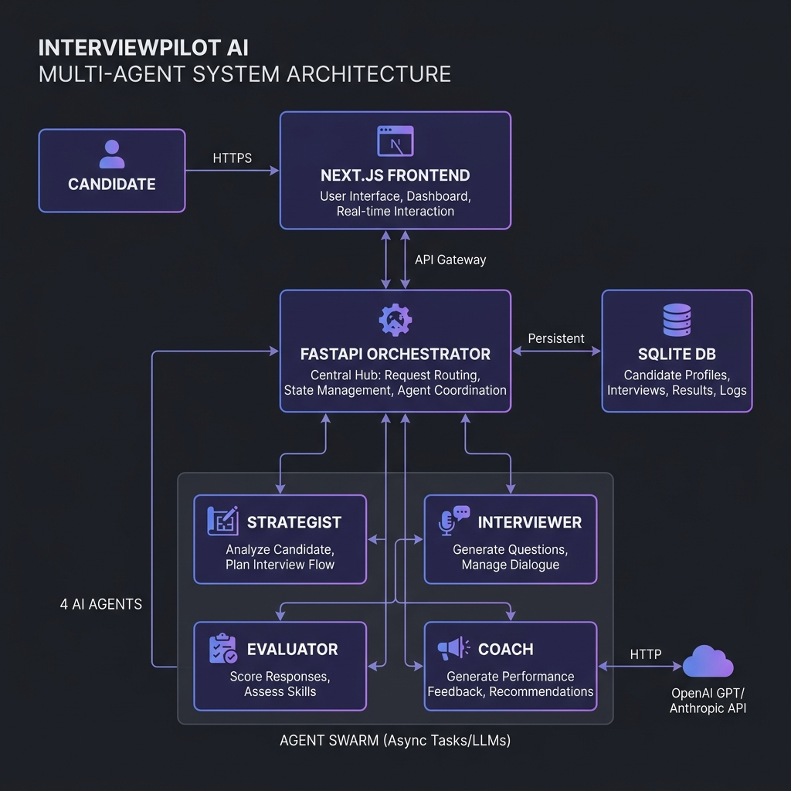

# 🚀 InterviewPilot AI

**Practice smarter. Interview better. Master the loop.**

InterviewPilot AI is a production-grade, multi-agent mock interview coaching platform. It pairs four specialized AI agents operating under a signal-driven orchestrator with a state-of-the-art Glassmorphic Next.js frontend. The platform simulates high-stakes technical, behavioral, and mixed-mode interviews, providing candidates with real-time feedback, responsive dialogue adjustments, and comprehensive career coaching reports.

---

## 🗺️ System Architecture

InterviewPilot AI organizes agent logic into four distinct components that coordinate via an orchestrator, relying on a signal-driven system to guide the dialogue naturally.



```mermaid
flowchart TD
    %% Styling
    classDef primary fill:#4f46e5,stroke:#4f46e5,color:#fff
    classDef agent fill:#1e1b4b,stroke:#4338ca,color:#e0e7ff,stroke-width:2px
    classDef database fill:#0f172a,stroke:#334155,color:#cbd5e1,stroke-dasharray: 5 5
    classDef client fill:#030712,stroke:#1f2937,color:#f9fafb

    %% Nodes
    Candidate([Candidate / User]):::client
    UI["Next.js 14 Web UI<br>(Glassmorphic Desktop)"]:::client
    Orchestrator["FastAPI Orchestrator<br>(main.py / orchestrator.py)"]:::primary
    DB[(SQLite Database<br>sessions.db)]:::database

    subgraph Agents ["Four Specialized AI Agents"]
        Strategist["Profile Strategist<br>(strategist.py)"]:::agent
        Interviewer["Adaptive Interviewer<br>(interviewer.py)"]:::agent
        Evaluator["Real-Time Evaluator<br>(evaluator.py)"]:::agent
        Coach["AI Career Coach<br>(coach.py)"]:::agent
    end

    %% Connections
    Candidate <-->|Interactive Chat| UI
    UI <-->|JSON REST API| Orchestrator
    Orchestrator <-->|Session State Persistence| DB

    %% Orchestration Loop Flow
    Orchestrator -->|1. Input: Role, Seniority, Type| Strategist
    Strategist -->|Output: Competencies, Difficulty, Strategy JSON| Orchestrator
    
    Orchestrator -->|2. Inputs: Q/A context + Evaluator Signal| Interviewer
    Interviewer -->|Output: Contextual Plain-Text Question| Orchestrator
    
    Orchestrator -->|3. Inputs: Question + Answer Pair| Evaluator
    Evaluator -->|Output: Scores & Signal (advance/probe/simplify)| Orchestrator

    Orchestrator -->|4. Input: Complete session history (5-7 turns)| Coach
    Coach -->|Output: Professional Markdown Feedback Report| Orchestrator
```

### The Multi-Agent System

| Agent | Responsibility | Core Inputs | Primary Output | System Prompt File |
| :--- | :--- | :--- | :--- | :--- |
| **Profile Strategist** | Pre-interview target planning and structuring. | Role background, type, seniority level. | Structural JSON strategy plan. | [strategist.md](prompts/strategist.md) |
| **Adaptive Interviewer** | Conducting conversational, natural, context-aware dialogue. | Full history, evaluator signals, strategy. | Clean conversational plain text. | [interviewer.md](prompts/interviewer.md) |
| **Real-Time Evaluator** | Assessing candidate responses on every turn. | Turn Q&A pair, seniority level. | Dimension scoring, advice, and routing signal. | [evaluator.md](prompts/evaluator.md) |
| **AI Career Coach** | Post-interview synthesis and growth planning. | Complete session transcript and evaluations. | Comprehensive markdown coaching report. | [coach.md](prompts/coach.md) |

### Dialogue & Signaling Coordination Loop

Instead of blinding chaining LLM calls, the orchestrator utilizes explicit, structured routing signals emitted by the **Evaluator** at every turn:

*   `advance`: The candidate answered successfully; advance to the next core competency or ask a more challenging question.
*   `probe`: The answer lacked detail, missed metrics, or contained vague buzzwords. Probe for specific metrics or deeper technical depth on this topic.
*   `simplify`: The candidate struggled, admitted to not knowing, or gave a very short answer. Rephrase the concept or approach from a simpler angle to keep the dialogue productive.
*   `wrap_up`: Signal to close the interview session, triggered once the minimum turns are reached or the evaluation finishes.

---

## 🛠️ Quick Start & Setup

The project supports both direct local deployment (recommended for development) and Docker containers.

### Local Installation (Fastest)

Prerequisites: **Python 3.10+** and **Node.js 18+**.

The repository comes with a PowerShell script (`start.ps1`) that will automatically provision your virtual environment, install backend and frontend dependencies, copy templates, and run both servers:

```powershell
# Run the automated launch script in your PowerShell window
.\start.ps1
```

#### Manual Startup Steps:

If you prefer to start the services manually, run the following in separate terminal shells:

**Backend Setup:**
```bash
# Initialize and activate virtual environment
python -m venv .venv
source .venv/bin/activate  # On Windows use: .\.venv\Scripts\activate

# Install dependencies
pip install -r backend/requirements.txt

# Start FastAPI dev server (with hot reload enabled)
export PYTHONPATH=$(pwd)
export MOCK_LLM=true
uvicorn backend.main:app --reload --host 127.0.0.1 --port 8000
```

**Frontend Setup:**
```bash
cd frontend
npm install

# Start Next.js development server
export NEXT_PUBLIC_API_URL=http://127.0.0.1:8000
npm run dev
```

Open **[http://localhost:3000](http://localhost:3000)** in your browser to begin practicing.

### Docker Compose Installation

If you prefer a containerized deployment, start the stack with one command:

```bash
docker compose up --build
```

Access the frontend app at **`http://localhost:3000`** and the backend at **`http://localhost:8000`**.

### Configuration (Mock vs. Live LLM Mode)

The application supports a zero-cost **Mock Mode** by default. This enables immediate testing of the orchestrator, state transition logic, and layout routing without configuring API keys:
*   Set `MOCK_LLM=true` in your `.env` (automatically copied from `.env.example`).
*   To enable live OpenAI generation, set `MOCK_LLM=false` and provide your `OPENAI_API_KEY` in the `.env` file.

---

## 💎 Premium Design Decisions & Trade-Offs

### 1. Robust Loop Guards (Anti-Loop Protections)
*   **The Problem**: In signal-based loops, if a candidate gives consecutive short responses to follow-up questions, the evaluator generates repeating `"probe"` or `"simplify"` signals, trapping the user in an infinite loop where they are repeatedly asked the exact same follow-up text.
*   **The Solution**: We implemented a strict **Loop Progress Guard** in the orchestrator. If the previous question was already a follow-up (`"probe"` or `"simplify"`), the orchestrator automatically overrides the next signal to `"advance"`. This acts as an interviewer fallback, ensuring the candidate always progresses to the next core competency, mimicking natural human dialogue.
*   **Turn-Based Mocks**: The mock client maps probe/simplify questions dynamically to each of the 5 interview stages (career goals, metrics, compromises, system scalability, active improvements) rather than returning a single static string.

### 2. Markdown-Based Versioned Prompts
*   **The Decision**: Prompts are stored in `.md` files in a dedicated `/prompts` folder rather than inlined inside Python code.
*   **The Trade-off**: Requires file-system reads during agent initialization (mitigated by prompt-loading utility caching), but decouples LLM instructions entirely from business logic, making prompts reviewable, version-controlled, and hot-editable.

### 3. Lightweight SQLite SQLite Database
*   **The Decision**: Used `aiosqlite` to achieve zero-config persistence for local demos and multi-session historical archives.
*   **The Trade-off**: Not suited for horizontal scaling across distributed worker nodes. However, for a single-host application and local dev coaching, it avoids the heavy infrastructure footprint of PostgreSQL/Redis while maintaining non-blocking asynchronous I/O.

---

## 📝 Example Interview Transcripts

These real-world transcript logs demonstrate how the system handles different candidate performance tiers in Mock Mode.

### 🟢 1. Strong Candidate (Senior Software Engineer)

The candidate demonstrates structured reasoning, concrete metrics, and clear project ownership.

```
Turn 1 — Opening
Interviewer: "Thanks for joining today. For the Senior Software Engineer position — focusing on motivation and fit — what draws you to this opportunity, and what would success look like in your first six months?"
Candidate: "I'm incredibly excited about scaling distributed systems at your scale. In month one, I would focus on mapping critical services, understanding the team's release patterns, and integrating into on-call rotation. By month six, I intend to own a major system reliability initiative with measurable SLO improvements."
Evaluator Signal: advance
Scores: Communication: 8.0, Technical Depth: 7.5, Structure: 8.0, Relevance: 8.5

Turn 2 — Core Competency (Project & Impact)
Interviewer: "Tell me about a project you're proud of. What was your specific contribution, and how did you measure impact?"
Candidate: "I led the caching layer overhaul for our checkout API. I designed the Redis replication topology, cut p95 latencies from 420ms to 180ms over 8 weeks, leading a squad of 4 engineers. This mitigated critical timeouts and protected $2M in GMV during peak sales seasons."
Evaluator Signal: advance
Scores: Communication: 9.0, Technical Depth: 8.5, Structure: 8.5, Relevance: 9.0
```

> **AI Coach Synthesis**:
> *   **Overall Score**: `84 / 100` · **Readiness Label**: `Strong Candidate`
> *   **Summary**: Outstanding structural delivery using metrics-oriented STAR narratives and solid architectural reasoning.
> *   **Next Steps**: Focus practice on edge-case failures during system design questions.

---

### 🔴 2. Weak Candidate (Product Manager)

The candidate relies heavily on buzzwords, lacks quantitative metrics, and struggles to clarify personal contributions.

```
Turn 1 — Opening
Interviewer: "Why PM, and why our company?"
Candidate: "I just really like products and building stuff. Your company is incredibly innovative and synergistic, and I think I can deliver amazing user-first experiences here."
Evaluator Signal: probe (triggered by short answer lacking concrete goals)
Scores: Communication: 5.0, Technical Depth: 3.5, Structure: 4.0, Relevance: 5.0

Turn 2 — Probe Follow-Up (Career Goals)
Interviewer: "That's interesting. Can you expand on how this role specifically aligns with your long-term career goals?"
Candidate: "I want to grow with the company and eventually secure a major decision-making role here."
Evaluator Signal: advance (forced by Orchestration Loop Guard to prevent infinite looping)

Turn 3 — Core Competency (Project & Impact)
Interviewer: "Tell me about a project you're proud of. What was your specific contribution, and how did you measure impact?"
Candidate: "We practiced agile methodologies and focused on tight stakeholder management. It went really well."
Evaluator Signal: probe (lacks quantified outcome)
Scores: Communication: 4.5, Technical Depth: 3.0, Structure: 3.5
```

> **AI Coach Synthesis**:
> *   **Overall Score**: `42 / 100` · **Readiness Label**: `Developing`
> *   **Key Gap**: High reliance on generic terminology; complete absence of STAR structure or measurable outcomes.
> *   **Practice Plan**: Draft 5 structured project stories with explicit Situation-Task-Action-Result mapping, ensuring each highlights at least one core success metric.

---

### 🟡 3. Tricky / Edge Case (Data Analyst)

The candidate handles gaps in knowledge gracefully, demonstrating honesty while recovering later in the session.

```
Turn 1 — Opening
Interviewer: "Thanks for joining. Why Data Analysis, and what draws you to this role?"
Candidate: "I love uncovering patterns in data and turning raw queries into actionable business dashboards."
Evaluator Signal: advance
Scores: Communication: 7.0, Technical Depth: 6.0

Turn 2 — Core Competency (Project & Technical Depth)
Interviewer: "How would you validate an A/B test that looks highly positive but exhibits a significantly uneven segment traffic split?"
Candidate: "I don't know the exact statistical formula off the top of my head — we usually let our data platform infrastructure team handle the core math checks."
Evaluator Signal: simplify (user was honest but missed the statistical framework)
Scores: Communication: 6.0, Technical Depth: 3.0, Structure: 4.0

Turn 3 — Simplified Follow-Up (Validation)
Interviewer: "No worries! To keep it simple: what is one thing you enjoyed doing in your previous work or projects?"
Candidate: "I really enjoyed querying our user analytics in SQL. I once uncovered that 20% of users abandoned checkout due to a local region payment bug, which helped our developers fix it."
Evaluator Signal: advance (recovery successful; candidate highlights practical troubleshooting and impact)
Scores: Communication: 7.5, Technical Depth: 6.5, Relevance: 8.0
```

> **AI Coach Synthesis**:
> *   **Overall Score**: `58 / 100` · **Readiness Label**: `Developing`
> *   **Noted Recovery**: Excellent handling of statistical gaps by pivoting to proven SQL validation and debugging accomplishments.
> *   **Practice Plan**: Enroll in an A/B testing stats module; practice explaining statistical power and SRM tests to non-technical partners.
